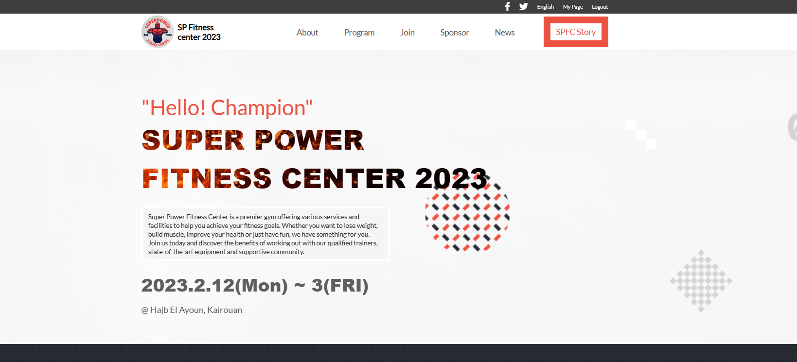

<a id="readme-top"></a>
<h1 align="center">🏋️‍♂️ SUPERPOWER FITNESS CENTER 🏋️‍♂️</h1>

<p align="center">
  <a href="https://github.com/chawkimbarki">
    
  </a>
  <a href="https://twitter.com/Chawki__Mbarki">
    
  </a>
  <a href="https://www.linkedin.com/in/chawki-mbarki-a77546202/">
    
  </a>
</p>

<p align="center">
  <strong>This project is a website that showcases the services and facilities offered by Superpower Fitness Center, a gym that helps you achieve your fitness goals with personalized training and support.</strong>
  <br>
    Whether you want to lose weight, gain muscle, or improve your health, this website will help you find the best plan for you. You can also learn more about the trainers, the equipment, and the testimonials from satisfied customers. This project demonstrates my skills in using HTML, CSS, and JavaScript to create a stunning and interactive website that attracts and engages visitors.
</p>
<div align="center">

</div>

<hr>
<!-- TABLE OF CONTENTS -->

# 📗 Table of Contents

- [📖 About the Project](#about-project)
  - [🛠 Built With](#built-with)
  - [Key Features](#key-features)
- [🚀 Live Demo](#live-demo)
- [🎥 Loom Video](#Loom-Video)
- [💻 Getting Started](#getting-started)
  - [Prerequisites](#prerequisites)
  - [Setup](#setup)
  - [Install](#install)
  - [Usage](#usage)
  - [Run tests](#run-tests)
  - [Deployment](#triangular_flag_on_post-deployment)
- [👥 Authors](#authors)
- [🔭 Future Features](#future-features)
- [🤝 Contributing](#contributing)
- [⭐️ Show your support](#support)
- [🙏 Acknowledgements](#acknowledgements)
- [❓ FAQ](#faq)
- [📝 License](#license)

<br>

# 📖 **SUPERPOWER FITNESS CENTER** <a id="about-project"></a>
    **SUPERPOWER FITNESS CENTER** is a website that showcases the services and facilities offered by SUPERPOWER FITNESS CENTER, a gym that helps you achieve your fitness goals with personalized training and support. Whether you want to lose weight, gain muscle, or improve your health, this website will help you find the best plan for you.
<br>

## 🛠 **Built With** <a id="built-with"></a>
- HTML
- CSS
- JavaScript
<br>

## **Key Features** <a id="key-features"></a>
- **Ease of use**
<p align="right">(<a href="#readme-top">back to top</a>)</p>

# 🚀 **Live Demo** <a id="live-demo"></a>
- [Click Here](https://chawkimbarki.github.io/Body-Building/)
<p align="right">(<a href="#readme-top">back to top</a>)</p>

## 🎥 **Loom Video** <a id="Loom-Video"></a>
- [Click Here](https://www.loom.com/share/bf844324517f49baad8bf9ff0340e9b5)
<p align="right">(<a href="#readme-top">back to top</a>)</p>

## 💻 **Getting Started** <a id="getting-started"></a>
  **To get a local copy up and running, follow these steps.**
<br>

### **Prerequisites**
  A computer
<br>

### **Setup**
```bash
# Clone this repository to your desired folder and run the following commands:
cd my-folder
git clone https://github.com/chawkimbarki/Body-Building.git
```
<br>

### **Install**
- You don't need to install anything
<br>

### **Usage**
- To use it open the `index.html` file.
<br>

### **Run tests**
```bash
# To run tests for linter errors, run the following command:

#For JavaScript :
npx eslint . --fix<
#For CSS :
npx stylelint "**/*.{css,scss}" --fix
```
<br>

### **Deployment**
- You can deploy this project using:
Github pages
<p align="right">(<a href="#readme-top">back to top</a>)</p>

## 👥 **Authors** <a id="authors"></a>
👤 **Chawki Mbarki**

- GitHub: [@chawkimbarki](https://github.com/chawkimbarki)
- Twitter: [@Chawki__Mbarki](https://twitter.com/Chawki__Mbarki)
- LinkedIn: [Chawki Mbarki](https://www.linkedin.com/in/chawki-mbarki-a77546202/)

<p align="right">(<a href="#readme-top">back to top</a>)</p>

## 🔭 **Future Features** <a id="future-features"></a>
- **A booking system that allows the users to reserve a slot or a class at the fitness center online.**<br>
- **A membership system that allows the users to sign up and log in to the website and access exclusive content and offers.**<br>
- **A social media integration that allows the users to share their fitness goals and achievements with their friends and followers.**

<p align="right">(<a href="#readme-top">back to top</a>)</p>

## 🤝 **Contributing** <a id="contributing"></a>
Contributions, issues, and feature requests are welcome!
Feel free to check the [issues page](https://github.com/chawkimbarki/Body-Building/issues).

<p align="right">(<a href="#readme-top">back to top</a>)</p>

## ⭐️ **Show your support** <a id="support"></a>
- Give a ⭐️ if you like this project!

<p align="right">(<a href="#readme-top">back to top</a>)</p>

## 🙏 **Acknowledgments** <a id="acknowledgements"></a>
- To [Cindy Shin](https://www.behance.net/adagio07), since the whole website is based on her template.

<p align="right">(<a href="#readme-top">back to top</a>)</p>

## ❓ **FAQ** <a id="faq"></a>
- **How can i get a copy of this on my local machine**
  - got to code and click on Download zip
- **did you use any framework to build this project**
  - No, this project is built by only using HTML, CSS, and JavaScript

<p align="right">(<a href="#readme-top">back to top</a>)</p>

## 📝 **License** <a id="license"></a>
This project is [MIT](./LICENSE) licensed.
